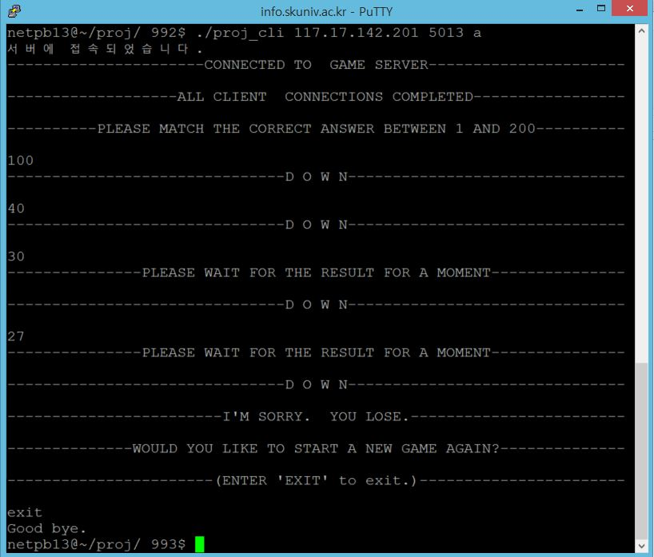
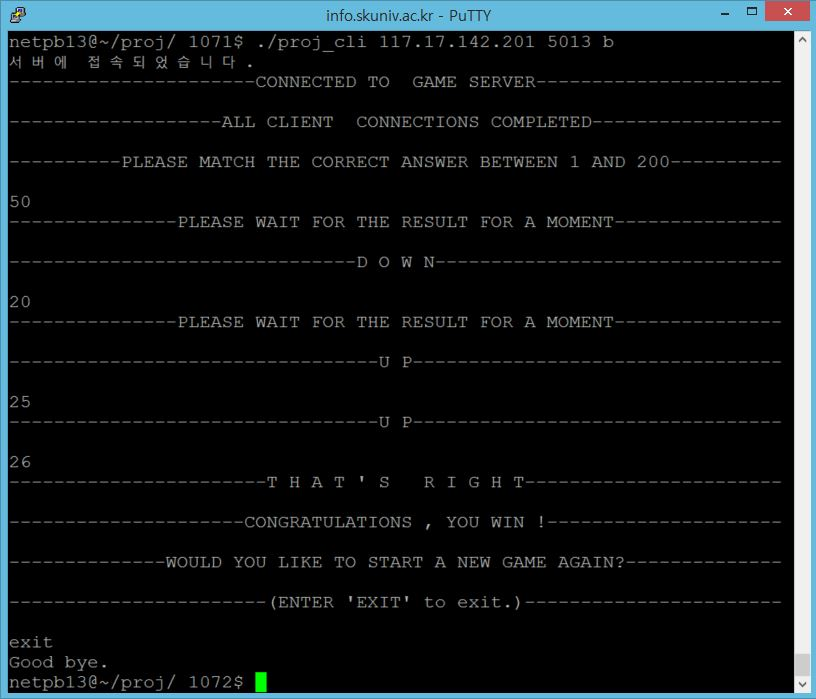
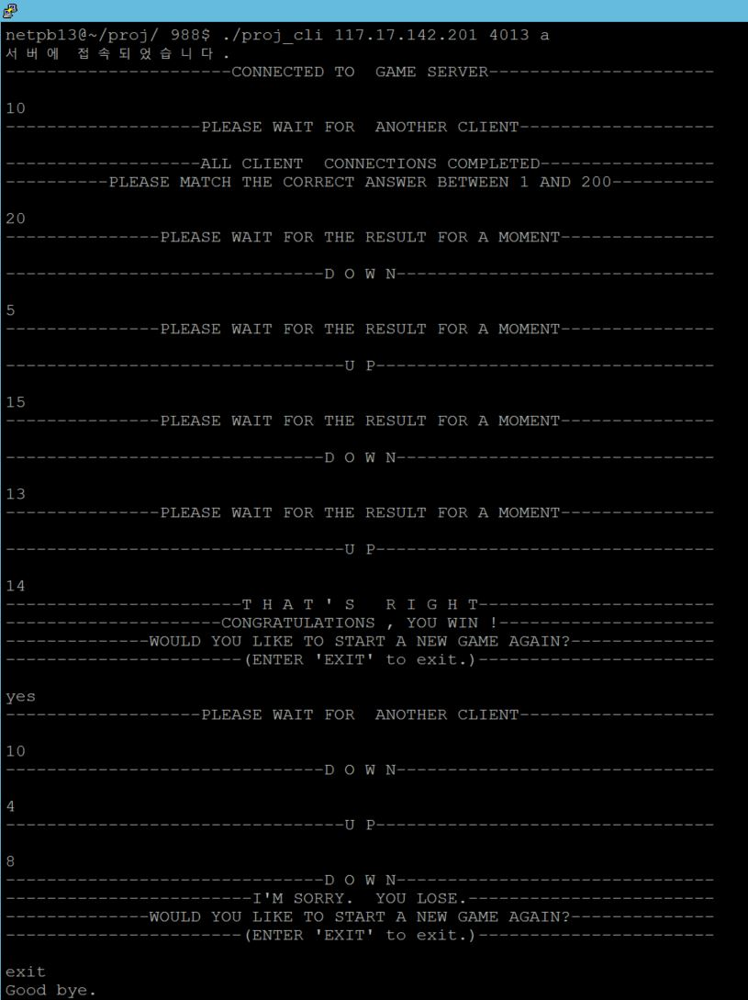
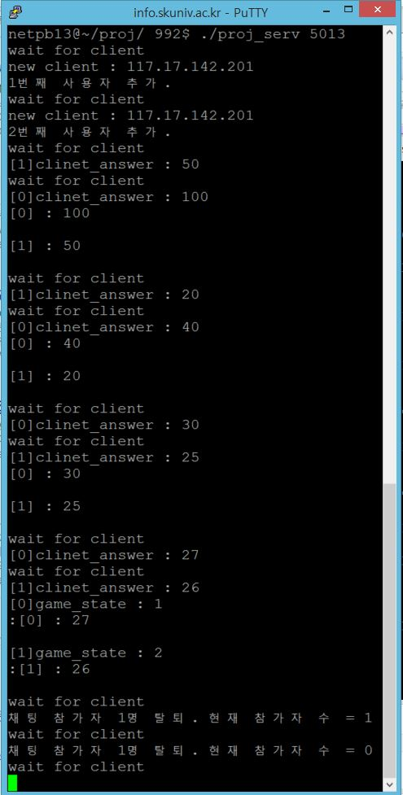

# Up-Down_Game

## About
- 소개
  - 2인 이상 플레이하는 Up & Down 게임
  - 서버는 숫자의 정답을 가지고 있고 클라이언트들은 숫자를 맞추는 겁니다. 예를 들어 정답이 100인데 클라이언트가 90이라고 입력하면 Up을 보내고 110이라고 입력하면 Down을 보냅니다. 서버는 클라이언트가 모두 정답을 보내오면 결과를 보내줍니다. 정답을 먼저 맞추는 클라이언트가 승리합니다.

- 기간
  - 2017.06.05 ~ 2017.07.02
- 관련기술
  - C

## Preview
|  |  |
|:---:|:---:|
|  |  |
